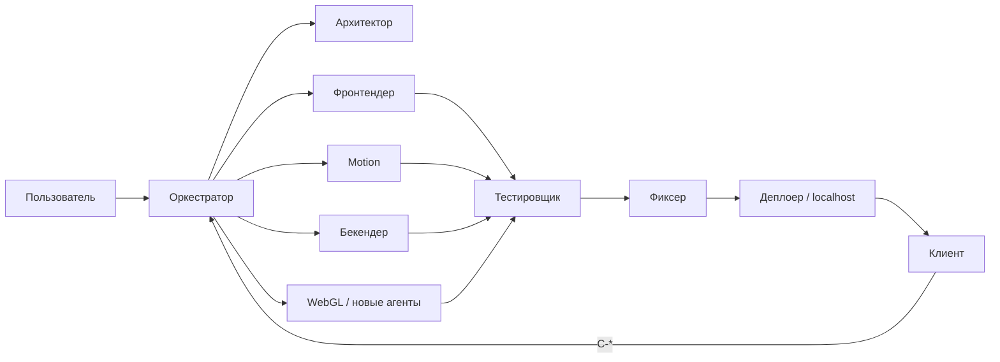

# Team Architecture — шаблон сильной команды агентов

Переносимая командная база: роли, skills, MCP, plugins и **универсальная** knowledge.

**Как перенести в новый сайт:** [`COPY_TO_NEW_PROJECT.md`](../COPY_TO_NEW_PROJECT.md) (в корне этой папки).

Домен конкретного продукта в `knowledge/` не хранится. Для новой зоны копируйте `knowledge/area_example/` в целевой проект.

Профиль команды: дорогие сайты (визуал + motion) + Cortana (Telegram HITL). Реестр: `.cursor/registry/agents.md`.  
Cortana context: skill `cortana-retrieval` у AI Bridge (не отдельная роль). Motion/WebGL — только по chain.  
Слабые места и следующие скиллы: `docs/TEAM_STRENGTH.md`.

## Контуры

## Что делает команду сильной

| Слой | Где лежит |
|------|-----------|
| Rules ролей | `.cursor/rules/` |
| Skills | `.cursor/skills/` + `.agents/skills/` |
| MCP | `.cursor/mcp.json`, `scripts/mcp/` |
| Plugins | `plugins/` ролей команды |
| Knowledge | `knowledge/engineering/`, `knowledge/area_example/` |
| Цикл | `docs/CLIENT_ORCHESTRATOR_CYCLE.md`, `promts`, `.cursor/prompts/` |
| Журнал | `memory/_templates/` |

## Расширение команды

Новых агентов складываем сюда же: rule + skill + строка в `.cursor/registry/agents.md` + при нужде оболочка в `knowledge/engineering/roles/`.
После регистрации они входят в команду Оркестратора.

## Жёсткие правила цикла

- Архитектор пишет spec + `chain.md` до кода.
- Оркестратор зовёт роли только по chain.
- Максимум 3 тикета `C-*` за проход.
- Закрытие только с guard.
- VPS/prod после Клиента без P0/P1 и явного согласования.
